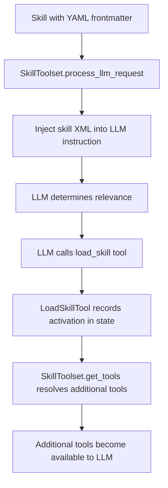

# Skills for ADK agents

Supported in ADKPython v1.25.0Experimental

An agent ***Skill*** is a self-contained unit of functionality that an ADK agent can use to perform a specific task. An agent Skill encapsulates the necessary instructions, resources, and tools required for a task, based on the [Agent Skill specification](https://agentskills.io/specification). The structure of a Skill allows it to be loaded incrementally to minimize the impact on the operating context window of the agent.

Experimental

The Skills feature is experimental and has some [known limitations](#known-limitations). We welcome your [feedback](https://github.com/google/adk-python/issues/new?template=feature_request.md&labels=skills)!

## Get started

Use the `SkillToolset` class to include one or more Skills in your agent definition and then add to your agent's tools list. You can define a [Skill in code](#inline-skills), or load the skill from a file definition, as shown below:

```python
import pathlib

from google.adk import Agent
from google.adk.skills import load_skill_from_dir
from google.adk.tools import skill_toolset

weather_skill = load_skill_from_dir(
    pathlib.Path(__file__).parent / "skills" / "weather_skill"
)

my_skill_toolset = skill_toolset.SkillToolset(
    skills=[weather_skill]
)

root_agent = Agent(
    model="gemini-2.5-flash",
    name="skill_user_agent",
    description="An agent that can use specialized skills.",
    instruction=(
        "You are a helpful assistant that can leverage skills to perform tasks."
    ),
    tools=[
        my_skill_toolset,
    ],
)
```

For a complete code example of an ADK agent with a Skill, including both file-based and in-line Skill definitions, see the code sample [skills_agent](https://github.com/google/adk-python/tree/main/contributing/samples/skills_agent).

## Define Skills

The Skills feature allows you to create modular packages of Skill instructions and resources that agents can load on demand. This approach helps you organize your agent's capabilities and optimize the context window by only loading instructions when they are needed. The structure of Skills is organized into three levels:

- **L1 (Metadata):** Provides metadata for skill discovery. This information is defined in the frontmatter section of the `SKILL.md` file and includes properties such as the Skill name and description.
- **L2 (Instructions):** Contains the primary instructions for the Skill, loaded when the Skill is triggered by the agent. This information is defined in the body of the `SKILL.md` file.
- **L3 (Resources):** Includes additional resources such as reference materials, assets, and scripts that can be loaded as needed. These resources are organized into the following directories:
  - `references/`: Additional Markdown files with extended instructions, workflows, or guidance.
  - `assets/`: Resource materials such as database schemas, API documentation, templates, or examples.
  - `scripts/`: Executable scripts supported by the agent runtime.

### Define Skills with files

The following directory structure shows the recommended way to include Skills in your ADK agent project. The `example_skill/` directory shown below, and any parallel Skill directories, must follow the [Agent Skill specification](https://agentskills.io/specification) file structure. Only the `SKILL.md` file is required.

```text
my_agent/
    agent.py
    .env
    skills/
        example_skill/        # Skill
            SKILL.md          # main instructions (required)
            references/
                REFERENCE.md  # detailed API reference
                FORMS.md      # form-filling guide
                *.md          # domain-specific information
            assets/
                *.*           # templates, images, data
            scripts/
                *.py          # utility scripts
```

Script execution not supported

Scripts execution is not yet supported and is a [known limitation](#known-limitations).

### Define Skills in code

In ADK agents, you can also define Skills within the code of the agent, using the `Skill` model class, as shown below. This method of Skill definition enables you to dynamically modify skills from your ADK agent code.

```python
from google.adk.skills import models

greeting_skill = models.Skill(
    frontmatter=models.Frontmatter(
        name="greeting-skill",
        description=(
            "A friendly greeting skill that can say hello to a specific person."
        ),
    ),
    instructions=(
        "Step 1: Read the 'references/hello_world.txt' file to understand how"
        " to greet the user. Step 2: Return a greeting based on the reference."
    ),
    resources=models.Resources(
        references={
            "hello_world.txt": "Hello! So glad to have you here!",
            "example.md": "This is an example reference.",
        },
    ),
)
```

## Known limitations

The Skills feature is experimental and includes the following limitations:

- **Script execution:** The Skills feature does not currently support script execution (`scripts/` directory).

## Skill Activation

The model activates a skill through a multi-step process involving YAML frontmatter parsing, LLM instruction injection, and dynamic tool resolution. Here's how it works:

## Skill Activation Flow

### 1. Skill Discovery and Frontmatter Parsing
Skills are discovered with YAML frontmatter in their `SKILL.md` files, which is parsed into `Frontmatter` objects containing metadata like `name`, `description`, and `adk_additional_tools` [1](#0-0) .

### 2. LLM Instruction Injection
The `SkillToolset.process_llm_request()` method injects available skills into the LLM instruction by:
- Adding default skill system instructions
- Formatting skills as XML using `prompt.format_skills_as_xml()` [2](#0-1) 

### 3. LLM Determines Relevance
When the LLM encounters a user query, it uses the injected skill descriptions to determine relevance. If a skill seems relevant, the LLM calls the `load_skill` tool with the skill name [3](#0-2) .

### 4. Skill Activation Recording
The `LoadSkillTool.run_async()` method records skill activation in agent state:
```python
state_key = f"_adk_activated_skill_{agent_name}"
activated_skills = list(tool_context.state.get(state_key, []))
if skill_name not in activated_skills:
    activated_skills.append(skill_name)
    tool_context.state[state_key] = activated_skills
``` [4](#0-3) 

### 5. Dynamic Tool Resolution
When `SkillToolset.get_tools()` is called, it checks for activated skills and resolves additional tools specified in the skill's `adk_additional_tools` metadata [5](#0-4) .

## Complete Activation Sequence



The key mechanism is that skill activation is stateful - once `load_skill` is called, the skill name is stored in agent state, and subsequent tool resolution calls will include any additional tools specified in that skill's frontmatter metadata [6](#0-5) .

## Notes
- The YAML frontmatter must include an `adk_additional_tools` key with a list of tool names to enable dynamic tool activation [7](#0-6) 
- Skills can specify additional tools that become available only after the skill is activated
- The system supports both individual tools and toolsets with prefixed tool names
- Tool name collisions are handled with error logging to prevent conflicts

Wiki pages you might want to explore:
- [Contributing Guidelines (google/adk-python)](/wiki/google/adk-python#12.5)
- [Instructions and Prompts (google/adk-python)](/wiki/google/adk-python#3.7)
- [Built-in Tools (google/adk-python)](/wiki/google/adk-python#6.6)

### Citations

**File:** src/google/adk/skills/models.py (L38-80)
```python
class Frontmatter(BaseModel):
  """L1 skill content: metadata parsed from SKILL.md for skill discovery.

  Attributes:
      name: Skill name in kebab-case or snake_case (required).
      description: What the skill does and when the model should use it
        (required).
      license: License for the skill (optional).
      compatibility: Compatibility information for the skill (optional).
      allowed_tools: A space-delimited list of tools that are pre-approved to
        run (optional, experimental). Accepts both ``allowed_tools`` and the
        YAML-friendly ``allowed-tools`` key. For more details, see
        https://agentskills.io/specification#allowed-tools-field.
      metadata: Key-value pairs for client-specific properties (defaults to
        empty dict). For example, to include additional tools, use the
        ``adk_additional_tools`` key with a list of tools.
  """

  model_config = ConfigDict(
      extra="allow",
      populate_by_name=True,
  )

  name: str
  description: str
  license: Optional[str] = None
  compatibility: Optional[str] = None
  allowed_tools: Optional[str] = Field(
      default=None,
      alias="allowed-tools",
      serialization_alias="allowed-tools",
  )
  metadata: dict[str, Any] = {}

  @field_validator("metadata")
  @classmethod
  def _validate_metadata(cls, v: dict[str, Any]) -> dict[str, Any]:
    if "adk_additional_tools" in v:
      tools = v["adk_additional_tools"]
      if not isinstance(tools, list):
        raise ValueError("adk_additional_tools must be a list of strings")
    return v

```

**File:** src/google/adk/tools/skill_toolset.py (L60-74)
```python
_DEFAULT_SKILL_SYSTEM_INSTRUCTION = """You can use specialized 'skills' to help you with complex tasks. You MUST use the skill tools to interact with these skills.

Skills are folders of instructions and resources that extend your capabilities for specialized tasks. Each skill folder contains:
- **SKILL.md** (required): The main instruction file with skill metadata and detailed markdown instructions.
- **references/** (Optional): Additional documentation or examples for skill usage.
- **assets/** (Optional): Templates, scripts or other resources used by the skill.
- **scripts/** (Optional): Executable scripts that can be run via bash.

This is very important:

1. If a skill seems relevant to the current user query, you MUST use the `load_skill` tool with `name="<SKILL_NAME>"` to read its full instructions before proceeding.
2. Once you have read the instructions, follow them exactly as documented before replying to the user. For example, If the instruction lists multiple steps, please make sure you complete all of them in order.
3. The `load_skill_resource` tool is for viewing files within a skill's directory (e.g., `references/*`, `assets/*`, `scripts/*`). Do NOT use other tools to access these files.
4. Use `run_skill_script` to run scripts from a skill's `scripts/` directory. Use `load_skill_resource` to view script content first if needed.
"""
```

**File:** src/google/adk/tools/skill_toolset.py (L151-158)
```python
    # Record skill activation in agent state for tool resolution.
    agent_name = tool_context.agent_name
    state_key = f"_adk_activated_skill_{agent_name}"

    activated_skills = list(tool_context.state.get(state_key, []))
    if skill_name not in activated_skills:
      activated_skills.append(skill_name)
      tool_context.state[state_key] = activated_skills
```

**File:** src/google/adk/tools/skill_toolset.py (L732-784)
```python
  async def _resolve_additional_tools_from_state(
      self, readonly_context: ReadonlyContext | None
  ) -> list[BaseTool]:
    """Resolves tools listed in the "adk_additional_tools" metadata of skills."""

    if not readonly_context:
      return []

    agent_name = readonly_context.agent_name
    state_key = f"_adk_activated_skill_{agent_name}"
    activated_skills = readonly_context.state.get(state_key, [])

    if not activated_skills:
      return []

    additional_tool_names = set()
    for skill_name in activated_skills:
      skill = self._skills.get(skill_name)
      if skill:
        additional_tools = skill.frontmatter.metadata.get(
            "adk_additional_tools"
        )
        if additional_tools:
          additional_tool_names.update(additional_tools)

    if not additional_tool_names:
      return []

    # Collect all candidate tools from both individual tools and toolsets
    candidate_tools = self._provided_tools_by_name.copy()
    if self._provided_toolsets:
      ts_results = await asyncio.gather(*(
          ts.get_tools_with_prefix(readonly_context)
          for ts in self._provided_toolsets
      ))
      for ts_tools in ts_results:
        for t in ts_tools:
          candidate_tools[t.name] = t

    resolved_tools = []
    existing_tool_names = {t.name for t in self._tools}
    for name in additional_tool_names:
      if name in candidate_tools:
        tool = candidate_tools[name]
        if tool.name in existing_tool_names:
          logger.error(
              "Tool name collision: tool '%s' already exists.", tool.name
          )
          continue
        resolved_tools.append(tool)
        existing_tool_names.add(tool.name)

    return resolved_tools
```

**File:** src/google/adk/tools/skill_toolset.py (L794-803)
```python
  async def process_llm_request(
      self, *, tool_context: ToolContext, llm_request: LlmRequest
  ) -> None:
    """Processes the outgoing LLM request to include available skills."""
    skills = self._list_skills()
    skills_xml = prompt.format_skills_as_xml(skills)
    instructions = []
    instructions.append(_DEFAULT_SKILL_SYSTEM_INSTRUCTION)
    instructions.append(skills_xml)
    llm_request.append_instructions(instructions)
```

**File:** tests/unittests/tools/test_skill_toolset.py (L1294-1379)
```python
async def test_skill_toolset_dynamic_tool_resolution(mock_skill1, mock_skill2):
  # Set up skills with additional_tools in metadata
  mock_skill1.frontmatter.metadata = {
      "adk_additional_tools": ["my_custom_tool", "my_func", "shared_tool"]
  }
  mock_skill1.name = "skill1"

  mock_skill2.frontmatter.metadata = {
      "adk_additional_tools": [
          "skill2_tool",
          "shared_tool",
          "prefixed_mock_tool",
      ]
  }
  mock_skill2.name = "skill2"

  # Prepare additional tools
  custom_tool = mock.create_autospec(skill_toolset.BaseTool, instance=True)
  custom_tool.name = "my_custom_tool"

  skill2_tool = mock.create_autospec(skill_toolset.BaseTool, instance=True)
  skill2_tool.name = "skill2_tool"

  shared_tool = mock.create_autospec(skill_toolset.BaseTool, instance=True)
  shared_tool.name = "shared_tool"

  def my_func():
    """My function description."""
    pass

  # Setup prefixed toolset
  mock_tool = mock.create_autospec(skill_toolset.BaseTool, instance=True)
  mock_tool.name = "prefixed_mock_tool"
  prefixed_set = mock.create_autospec(skill_toolset.BaseToolset, instance=True)
  prefixed_set.get_tools_with_prefix.return_value = [mock_tool]

  toolset = skill_toolset.SkillToolset(
      [mock_skill1, mock_skill2],
      additional_tools=[
          custom_tool,
          skill2_tool,
          shared_tool,
          my_func,
          prefixed_set,
      ],
  )

  ctx = _make_tool_context_with_agent()
  # Initial tools (only core)
  tools = await toolset.get_tools(readonly_context=ctx)
  assert len(tools) == 4

  # Activate skills
  load_tool = skill_toolset.LoadSkillTool(toolset)
  await load_tool.run_async(args={"name": "skill1"}, tool_context=ctx)
  await load_tool.run_async(args={"name": "skill2"}, tool_context=ctx)

  # Dynamic tools should now be resolved
  tools = await toolset.get_tools(readonly_context=ctx)
  tool_names = {t.name for t in tools}

  # Core tools
  assert "list_skills" in tool_names
  assert "load_skill" in tool_names
  assert "load_skill_resource" in tool_names
  assert "run_skill_script" in tool_names

  # Skill 1 tools
  assert "my_custom_tool" in tool_names
  assert "my_func" in tool_names

  # Skill 2 tools
  assert "skill2_tool" in tool_names

  # Shared tool (should only appear once)
  assert "shared_tool" in tool_names
  assert len([t for t in tools if t.name == "shared_tool"]) == 1

  # Prefixed toolset tool
  assert "prefixed_mock_tool" in tool_names

  # Check specific tool resolution details
  my_func_tool = next(t for t in tools if t.name == "my_func")
  assert isinstance(my_func_tool, skill_toolset.FunctionTool)
  assert my_func_tool.description == "My function description."

```

