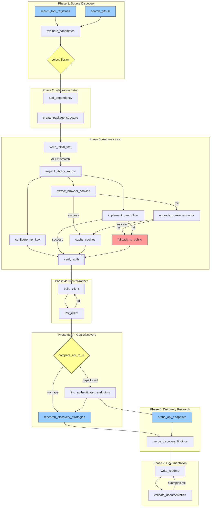

# Source Integration DAG Template

A parameterized directed acyclic graph for building research integrations against any rich data source. Designed to be followed by an autonomous workflow agent.

---

## DAG Specification

```yaml
dag:
  name: "source_integration_pipeline"
  version: "1.0"
  description: >
    End-to-end pipeline for discovering, evaluating, authenticating,
    wrapping, and documenting a new data source integration.

parameters:
  source_name: "string — e.g., substack, medium, arxiv, hackernews"
  language: "python | typescript | go"
  auth_method: "cookie | api_key | oauth | none"
  project_root: "absolute path to project root"
  package_path: "relative path for source package, e.g., skills/research/sources"
  package_manager: "uv | pip | npm | pnpm"
  browser: "chrome | firefox | edge  # only relevant if auth_method=cookie"
  discovery_topics: "list of topic strings to seed discovery research"

nodes:
  # ═══════════════════════════════════════════════════════════════
  # PHASE 1: SOURCE DISCOVERY
  # ═══════════════════════════════════════════════════════════════

  - id: search_tool_registries
    name: "Search curated tool registries"
    phase: discovery
    depends_on: []
    parallel_with: [search_github]
    inputs: [source_name, language]
    outputs: [registry_candidates]
    tools: ["npx skills find", "npx skillfish search"]
    decision_point: false
    retry:
      on_failure: search_github  # registries are often empty; not blocking
      max_attempts: 1
    description: >
      Search skills.sh and skillfish registries for a pre-built integration.
      These are fast checks (seconds) that occasionally surface curated tools.
      Empty results are expected and non-blocking.

  - id: search_github
    name: "Search GitHub for libraries"
    phase: discovery
    depends_on: []
    parallel_with: [search_tool_registries]
    inputs: [source_name, language]
    outputs: [github_candidates]
    tools: [WebSearch]
    decision_point: false
    retry:
      on_failure: null
      max_attempts: 2
    description: >
      Broad GitHub search: '"<source> API" OR "<source> scraper" language:<lang> stars:>10'.
      Categorize results into scraper/downloader/API-wrapper/SDK.
      Record: repo URL, stars, last commit, language, install method, license.
      Target: 8-15 candidates.

  - id: evaluate_candidates
    name: "Deep-evaluate top candidates"
    phase: discovery
    depends_on: [search_tool_registries, search_github]
    inputs: [registry_candidates, github_candidates]
    outputs: [evaluation_matrix]
    tools: [WebFetch, "mcp__deepwiki__read_wiki_structure"]
    decision_point: false
    retry:
      on_failure: null
      max_attempts: 1
    description: >
      Select top 2-3 candidates by stars and relevance. For each:
      - Fetch README directly (DeepWiki may not have indexed smaller repos)
      - Assess: API surface, auth support, maintenance, test coverage, types
      - Build comparison matrix: [name, stars, last_commit, api_coverage, auth, install]

  - id: select_library
    name: "Select library or decide to build from scratch"
    phase: discovery
    depends_on: [evaluate_candidates]
    inputs: [evaluation_matrix]
    outputs: [chosen_library, capability_inventory, known_gaps]
    tools: []
    decision_point: true
    retry:
      on_failure: null
      max_attempts: 1
    description: >
      DECISION: Pick the best library based on:
        1. Language fit (must match project language)
        2. API coverage (>60% of desired features)
        3. Maintenance (commit in last 6 months)
        4. Install simplicity (pip/npm > git clone)
      If no library scores above threshold: plan to build thin HTTP client
      from scratch against the source's REST/GraphQL API.

  # ═══════════════════════════════════════════════════════════════
  # PHASE 2: INTEGRATION SETUP
  # ═══════════════════════════════════════════════════════════════

  - id: add_dependency
    name: "Add dependency to project manifest"
    phase: setup
    depends_on: [select_library]
    inputs: [chosen_library, project_root, package_manager]
    outputs: [updated_manifest]
    tools: [Edit, Bash]
    decision_point: false
    retry:
      on_failure: null
      max_attempts: 2
    description: >
      Add the chosen library to pyproject.toml / package.json.
      Run '<package_manager> sync' or equivalent to install.
      Verify import succeeds in a quick test.

  - id: create_package_structure
    name: "Create source package directory"
    phase: setup
    depends_on: [add_dependency]
    inputs: [project_root, package_path, source_name]
    outputs: [source_directory]
    tools: [Bash, Write]
    decision_point: false
    retry:
      on_failure: null
      max_attempts: 1
    description: >
      Create: <project_root>/<package_path>/<source_name>/
      Create __init__.py at each new directory level.
      Copy upstream README into the source directory for reference.

  # ═══════════════════════════════════════════════════════════════
  # PHASE 3: AUTHENTICATION ENGINEERING
  # ═══════════════════════════════════════════════════════════════

  - id: write_initial_test
    name: "Write initial test script"
    phase: auth
    depends_on: [create_package_structure]
    inputs: [chosen_library, source_directory]
    outputs: [test_script, api_surface_notes]
    tools: [Write, Bash]
    decision_point: false
    retry:
      on_failure: inspect_library_source
      max_attempts: 2
    description: >
      Write a minimal test script that imports the library and calls
      its basic public API. Expect failures — README examples often
      have incorrect signatures. Record actual error messages.

  - id: inspect_library_source
    name: "Inspect actual library API surface"
    phase: auth
    depends_on: [write_initial_test]
    inputs: [chosen_library]
    outputs: [real_api_signatures]
    tools: [Bash]
    decision_point: false
    retry:
      on_failure: null
      max_attempts: 1
    description: >
      Use 'inspect.getsource()' or read installed library files to
      discover actual class/function signatures. Fix test script to
      match real API surface, not documented one.

  # --- Auth branch: cookie-based ---

  - id: extract_browser_cookies
    name: "Extract cookies from browser DB"
    phase: auth
    depends_on: [inspect_library_source]
    inputs: [browser, source_name]
    outputs: [cookies_json]
    tools: [Bash]
    decision_point: false
    condition: "auth_method == 'cookie'"
    retry:
      on_failure: upgrade_cookie_extractor
      max_attempts: 1
    description: >
      Use browser-cookie3 (Python) or equivalent to read cookies
      from the browser's encrypted SQLite database.
      Target cookies: session ID, auth tokens specific to the source.
      DO NOT attempt: browser automation, JS document.cookie (httpOnly blocked),
      manual Chrome cookie decryption (encryption varies by version/OS).

  - id: upgrade_cookie_extractor
    name: "Upgrade cookie extraction library and retry"
    phase: auth
    depends_on: [extract_browser_cookies]
    inputs: [package_manager]
    outputs: [cookies_json]
    tools: [Bash]
    decision_point: false
    condition: "auth_method == 'cookie' AND extract_browser_cookies.failed"
    retry:
      on_failure: fallback_to_public
      max_attempts: 1
    description: >
      pip install --upgrade browser-cookie3 (or equivalent).
      Force reimport (clear sys.modules cache). Retry extraction.
      If still fails, fall through to public-only fallback.

  - id: cache_cookies
    name: "Cache extracted cookies to disk"
    phase: auth
    depends_on: [extract_browser_cookies]
    inputs: [cookies_json, source_name]
    outputs: [cookie_cache_path]
    tools: [Write]
    decision_point: false
    condition: "auth_method == 'cookie' AND extract_browser_cookies.succeeded"
    retry:
      on_failure: null
      max_attempts: 1
    description: >
      Save cookies to ~/.config/<source_name>/cookies.json.
      This serves as fallback if live extraction fails in future runs.

  # --- Auth branch: API key ---

  - id: configure_api_key
    name: "Configure API key from env/config"
    phase: auth
    depends_on: [inspect_library_source]
    inputs: [source_name]
    outputs: [api_key_location]
    tools: [Bash]
    decision_point: false
    condition: "auth_method == 'api_key'"
    retry:
      on_failure: null
      max_attempts: 1
    description: >
      Read API key from environment variable (<SOURCE_NAME>_API_KEY)
      or config file (~/.config/<source_name>/api_key).
      Validate key with a lightweight authenticated API call.

  # --- Auth branch: OAuth ---

  - id: implement_oauth_flow
    name: "Implement OAuth token flow"
    phase: auth
    depends_on: [inspect_library_source]
    inputs: [source_name, chosen_library]
    outputs: [oauth_tokens, refresh_logic]
    tools: [Write, Bash]
    decision_point: false
    condition: "auth_method == 'oauth'"
    retry:
      on_failure: fallback_to_public
      max_attempts: 2
    description: >
      Implement OAuth authorization code or client credentials flow.
      Store refresh token to ~/.config/<source_name>/oauth.json.
      Implement automatic token refresh on 401 responses.

  # --- Auth convergence ---

  - id: fallback_to_public
    name: "Degrade to public-only API"
    phase: auth
    depends_on: []
    inputs: [source_name]
    outputs: [public_only_flag]
    tools: []
    decision_point: true
    condition: "all auth branches failed"
    retry:
      on_failure: null
      max_attempts: 1
    description: >
      DECISION: Accept public-only API access. Document which features
      are unavailable. The client wrapper must handle this gracefully
      (no crashes on missing auth, just reduced functionality).

  - id: verify_auth
    name: "Verify authentication works end-to-end"
    phase: auth
    depends_on: [cache_cookies, configure_api_key, implement_oauth_flow, fallback_to_public]
    inputs: [test_script]
    outputs: [auth_verified, public_vs_auth_diff]
    tools: [Bash]
    decision_point: false
    retry:
      on_failure: fallback_to_public
      max_attempts: 1
    description: >
      Run test script with auth. Compare authenticated response to
      public response. Record the delta (what auth unlocks).
      Note: depends_on includes all auth branches but only the
      relevant branch will have executed (conditional edges).

  # ═══════════════════════════════════════════════════════════════
  # PHASE 4: SELF-HEALING CLIENT WRAPPER
  # ═══════════════════════════════════════════════════════════════

  - id: build_client
    name: "Build client wrapper with self-healing auth"
    phase: client
    depends_on: [verify_auth]
    inputs: [chosen_library, auth_method, source_directory, public_vs_auth_diff]
    outputs: [client_module]
    tools: [Write]
    decision_point: false
    retry:
      on_failure: null
      max_attempts: 1
    description: >
      Create client.py with:
      - Lazy auth resolution (not at construction time)
      - Process-lifetime session caching
      - Self-healing pipeline: primary auth -> retry/upgrade -> cache -> public fallback
      - High-level methods that hide auth plumbing
      - Type hints on all public methods

  - id: test_client
    name: "Test client against real data"
    phase: client
    depends_on: [build_client]
    inputs: [client_module]
    outputs: [client_test_results]
    tools: [Bash]
    decision_point: false
    retry:
      on_failure: build_client
      max_attempts: 3
    description: >
      Exercise every public method on the client.
      Verify: auth works, public fallback works, error handling works.
      Compare results to what user sees in the source's UI.

  # ═══════════════════════════════════════════════════════════════
  # PHASE 5: API GAP DISCOVERY
  # ═══════════════════════════════════════════════════════════════

  - id: compare_api_to_ui
    name: "Compare API results to UI (find hidden data)"
    phase: gaps
    depends_on: [test_client]
    inputs: [client_module, source_name]
    outputs: [gap_report]
    tools: [Bash, "mcp__snap-happy__TakeScreenshot"]
    decision_point: true
    retry:
      on_failure: null
      max_attempts: 1
    description: >
      DECISION POINT: Compare API output to what the user sees in their
      browser. Identify data that the UI shows but the API hides.
      Example: Substack's public API hid 8/94 subscriptions (paid subs).
      Take screenshots of UI for comparison evidence.
      If gaps found: proceed to find_authenticated_endpoints.
      If no gaps: skip to discovery_research.

  - id: find_authenticated_endpoints
    name: "Probe for authenticated endpoints that fill gaps"
    phase: gaps
    depends_on: [compare_api_to_ui]
    inputs: [gap_report, source_name]
    outputs: [new_endpoints, updated_client]
    tools: [Bash]
    decision_point: false
    condition: "compare_api_to_ui.gaps_found"
    retry:
      on_failure: null
      max_attempts: 1
    description: >
      Probe common REST patterns for authenticated equivalents:
        /api/v1/<resource> (public) vs /api/v1/me/<resource> (auth)
        /api/v1/<resource> with vs without cookies
      Update client.py to prefer authenticated endpoints where they
      return more complete data.

  # ═══════════════════════════════════════════════════════════════
  # PHASE 6: DISCOVERY RESEARCH (PARALLEL)
  # ═══════════════════════════════════════════════════════════════

  - id: research_discovery_strategies
    name: "Research discovery/exploration strategies"
    phase: discovery_research
    depends_on: [find_authenticated_endpoints]
    parallel_with: [probe_api_endpoints]
    inputs: [source_name, discovery_topics]
    outputs: [strategy_report]
    tools: [WebSearch, WebFetch]
    decision_point: false
    retry:
      on_failure: null
      max_attempts: 1
    description: >
      Research how others discover content/creators on this source:
      - Blog posts, community guides, documentation
      - Recommendation systems, trending feeds, category taxonomies
      - Third-party tools that augment discovery
      - Graph-based exploration (who recommends whom)
      Output: ranked list of discovery strategies with feasibility notes.

  - id: probe_api_endpoints
    name: "Brute-force probe API endpoints"
    phase: discovery_research
    depends_on: [find_authenticated_endpoints]
    parallel_with: [research_discovery_strategies]
    inputs: [source_name, auth_method]
    outputs: [endpoint_catalog]
    tools: [Bash]
    decision_point: false
    retry:
      on_failure: null
      max_attempts: 1
    description: >
      Systematically probe common API patterns:
        /api/v1/trending, /api/v1/categories, /api/v1/search,
        /api/v1/feed, /api/v1/recommendations, /api/v1/popular
      For each endpoint: test with and without auth, record response
      shape, pagination method, rate limits, query parameters.
      Output: full endpoint catalog with auth requirements.

  - id: merge_discovery_findings
    name: "Merge parallel research into discovery pipeline"
    phase: discovery_research
    depends_on: [research_discovery_strategies, probe_api_endpoints]
    inputs: [strategy_report, endpoint_catalog]
    outputs: [discovery_pipeline, scoring_criteria]
    tools: []
    decision_point: false
    retry:
      on_failure: null
      max_attempts: 1
    description: >
      Cross-reference strategies with discovered endpoints.
      Design multi-layer discovery pipeline:
        Layer 1: Structured seeding (categories, rankings)
        Layer 2: Real-time signals (trending, recent)
        Layer 3: Targeted search (keyword-driven, may require auth)
        Layer 4: Graph walk (recommendations, citations, links)
      Define scoring criteria for ranking discovered entities.

  # ═══════════════════════════════════════════════════════════════
  # PHASE 7: DOCUMENTATION
  # ═══════════════════════════════════════════════════════════════

  - id: write_readme
    name: "Write comprehensive README"
    phase: documentation
    depends_on: [merge_discovery_findings]
    inputs: [client_module, endpoint_catalog, discovery_pipeline, scoring_criteria]
    outputs: [readme]
    tools: [Write]
    decision_point: false
    retry:
      on_failure: null
      max_attempts: 2
    description: >
      Create README.md in the source directory covering:
      - Usage examples for every public client method
      - Auth setup instructions (specific to auth_method)
      - Full API endpoint reference (public vs authenticated table)
      - Discovery pipeline strategy
      - Limitations and caveats
      - Comparison tables (public vs auth features)

  - id: validate_documentation
    name: "Cross-check docs against actual behavior"
    phase: documentation
    depends_on: [write_readme]
    inputs: [readme, client_module]
    outputs: [validated_readme]
    tools: [Bash, Read]
    decision_point: false
    retry:
      on_failure: write_readme
      max_attempts: 2
    description: >
      Run every code example in the README. Fix any that fail.
      Verify endpoint reference matches actual probe results.
      Ensure auth instructions work from a clean state.
```

---

## Mermaid Diagram



**Legend**: Yellow = decision point, Blue = parallel nodes, Red = fallback/degradation path.

---

## How to Instantiate This DAG for a New Source

### Step 1: Set Parameters

Fill in the parameter block for your target source. Examples:

| Parameter | Medium | Arxiv | HackerNews |
|-----------|--------|-------|------------|
| `source_name` | `medium` | `arxiv` | `hackernews` |
| `language` | `python` | `python` | `python` |
| `auth_method` | `cookie` | `none` | `cookie` |
| `package_path` | `skills/research/sources` | `skills/research/sources` | `skills/research/sources` |
| `package_manager` | `uv` | `uv` | `uv` |
| `browser` | `chrome` | N/A | `chrome` |
| `discovery_topics` | `["AI", "startups"]` | `["cs.AI", "cs.LG"]` | `["AI", "Show HN"]` |

### Step 2: Evaluate Conditional Branches

Based on `auth_method`, entire branches of the DAG are skipped:

- **`auth_method=none`** (Arxiv): Skip all of Phase 3 auth branches. The `verify_auth` node still runs but confirms public-only access. Phase 5 gap discovery is likely a no-op (no authenticated endpoints to find).

- **`auth_method=cookie`** (Medium, HackerNews): Follow the cookie extraction pipeline. Key cookies to target:
  - Medium: `sid`, `uid`
  - HackerNews: `user` cookie (simple auth token, not encrypted)

- **`auth_method=api_key`** (OpenAI, Anthropic, etc.): Single node, no retry pipeline needed. Just read from env.

- **`auth_method=oauth`** (Google, GitHub): Most complex branch. May need to register an OAuth app, handle redirect URIs, implement PKCE.

### Step 3: Adapt Discovery Layers

The 4-layer discovery pipeline maps differently per source:

| Layer | Substack | Medium | Arxiv | HackerNews |
|-------|----------|--------|-------|------------|
| **Structured seeding** | 31 categories, `paid` sort | Tags, topics | arXiv categories (cs.AI, etc.) | Front page, Show/Ask/Jobs |
| **Real-time signals** | `/api/v1/trending` | Trending on Medium | Recent submissions, daily digests | `/best`, `/newest` |
| **Targeted search** | Publication search (auth) | Tag/keyword search | arXiv search API, semantic scholar | Algolia HN search API |
| **Graph walk** | Recommendation graph | "Related publications" | Citation graph (semantic scholar) | Who comments on whom, user submissions |

### Step 4: Execute the DAG

Walk the nodes in topological order. For each node:

1. Check `condition` -- skip if condition is false
2. Check `depends_on` -- all must be complete
3. Execute using listed `tools`
4. If node fails and has `retry.on_failure`: jump to the fallback node
5. If node is a `decision_point`: evaluate the decision criteria before choosing the next edge
6. If node has `parallel_with`: execute those nodes concurrently

### Step 5: Source-Specific Considerations

**Medium:**
- Medium's API is severely limited (deprecated public API). Most data requires scraping.
- Consider `medium-api` (unofficial) or `scrapingbee` for rendered HTML.
- Auth is cookie-based (`sid` cookie from Chrome).
- Discovery: tags are the primary taxonomy, no recommendation graph API.

**Arxiv:**
- Fully public API (no auth needed). OAI-PMH and Arxiv API for metadata.
- `arxiv` Python package is well-maintained and pip-installable.
- Discovery: category-based (cs.AI, cs.LG, etc.), citation graph via Semantic Scholar API.
- Gap discovery phase is minimal -- API is comprehensive for metadata.

**HackerNews:**
- Official Firebase API is public and well-documented.
- Algolia search API provides full-text search across all HN content.
- Auth only needed for user-specific actions (upvotes, submissions).
- Discovery: front page algorithm is the primary signal, user karma is secondary.
- Cookie extraction is simple (HN uses plain-text cookies, no encryption).

**RSS-based sources (blogs, podcasts):**
- Set `auth_method=none` -- RSS is public by design.
- Skip Phases 3 and 5 entirely.
- Library selection: `feedparser` (Python) is the universal choice.
- Discovery: OPML import/export, podcast directories, blogroll links.

---

## Execution Checklist

Use this checklist when instantiating the DAG for a new source:

```
[ ] Parameters filled in
[ ] auth_method conditional branches identified
[ ] Phase 1: Library selected (or decision to build from scratch)
[ ] Phase 2: Package structure created, dependency installed
[ ] Phase 3: Auth working (or gracefully degraded to public)
[ ] Phase 4: Client wrapper built with self-healing auth
[ ] Phase 5: API gaps identified and patched with auth endpoints
[ ] Phase 6: Discovery pipeline designed (parallel research complete)
[ ] Phase 7: README written and validated
[ ] All code examples in README tested and passing
```
